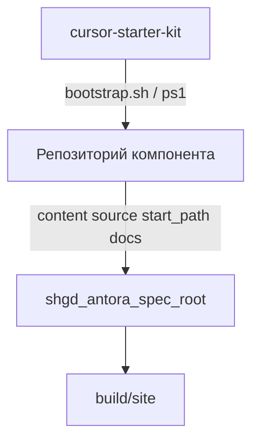

# План: переход на Antora-документацию в репозиториях компонентов

## Контекст

**cursor-starter-kit** становится шаблоном **репозитория компонента** — репозитория с кодом/правилами Cursor и Antora-документацией, который подключается к центральной сборке.

**Целевая платформа:** GitLab (рендер `README.adoc` на главной проекта; хостинг Git-источников для Antora).

**Модель документации:** вся проектная документация — AsciiDoc в `docs/modules/`; Markdown в `docs/` удаляется.

## Три роли репозиториев

| Роль | Пример | Ответственность |
|------|--------|-----------------|
| **Шаблон компонента** | `cursor-starter-kit` | Каркас `.cursor/rules`, Antora-компонент в `docs/`, bootstrap-скрипты, workflow создания новых компонентов |
| **Центральная сборка** | [shgd_antora_spec_root](https://github.com/retverd/shgd_antora_spec_root) | `antora-playbook.yml`, Docker/Compose, платформенная документация, `build/site` |
| **Репозиторий компонента** | [antora-test-comp-b](https://github.com/retverd/antora-test-comp-b) | Документация одного продукта/подсистемы; регистрируется в playbook как Git-источник |



**Граница ответственности репозитория компонента:**
- владеет AsciiDoc-страницами, `nav.adoc`, `docs/antora.yml`, правилами Cursor;
- **не** содержит playbook, Dockerfile Antora, UI-тему, CI публикации сайта;
- **не** собирает сайт локально (на первом этапе) — проверка через центральный репозиторий.

## Контракт репозитория компонента

### Обязательная структура

Дескриптор Antora в `docs/`, подключение через `start_path: docs`.

```text
.
├── README.adoc                 # обзор репозитория для GitLab
├── LICENSE
├── .cursor/
│   └── rules/                  # правила агента (не входят в Antora)
├── docs/
│   ├── antora.yml              # дескриптор Antora-компонента
│   └── modules/
│       └── ROOT/
│           ├── nav.adoc
│           └── pages/
│               ├── index.adoc
│               └── ...         # остальные страницы
└── scripts/                    # опционально: bootstrap и др.
```

**Альтернатива:** `antora.yml` и `modules/` в корне — только если репозиторий **без** `.cursor/` и без смешения с другими файлами в `docs/`. Для проектов из starter-kit **не использовать**.

### Обязательные файлы и поля

#### `docs/antora.yml`

Минимальный контракт (placeholder в шаблоне → заменить при инициализации):

```yaml
name: project-name          # уникальный ID компонента в playbook; kebab-case, латиница
title: Название проекта     # отображаемое имя в UI сайта
version: true               # или фиксированная semver, напр. '1.0'
nav:
  - modules/ROOT/nav.adoc
```

Правила для `name`:
- уникален среди всех `content.sources` центрального playbook;
- совпадает с префиксом в межкомпонентных xref: `xref:project-name::page.adoc[]`;
- не менять без согласования с владельцем playbook (ломает внешние xref).

#### `docs/modules/ROOT/nav.adoc`

Единственный источник навигации компонента. Каждая публикуемая страница должна быть reachable через nav (прямо или вложенным списком).

Пример целевой навигации шаблона:

```asciidoc
* xref:index.adoc[]
* Архитектура
** xref:architecture/overview.adoc[]
** xref:architecture/decisions.adoc[]
* Компоненты
** xref:components/backend.adoc[]
** xref:components/frontend.adoc[]
** xref:components/data-platform.adoc[]
* Процессы
** xref:workflows/new-project-bootstrap.adoc[]
** xref:workflows/adding-new-rule.adoc[]
** xref:workflows/antora-component-repo.adoc[]
* Шаблоны
** xref:templates/adr-template.adoc[]
** xref:templates/component-doc-template.adoc[]
** xref:templates/rule-change-proposal-template.adoc[]
```

Страницы из `pages/templates/` — **шаблоны для копирования**, в nav включаются как справочник; при создании реального ADR/документа добавлять новую страницу в `pages/`, а не редактировать шаблон на месте.

#### `docs/modules/ROOT/pages/index.adoc`

Стартовая страница компонента в Antora-сайте (не путать с `README.adoc`):
- `:navtitle:` для краткого пункта меню;
- краткое назначение компонента документации;
- ссылки xref на ключевые разделы (`overview`, workflow подключения к playbook).

#### `README.adoc` (корень)

Краткий обзор **репозитория** для GitLab: назначение, как инициализировать из шаблона, ссылка на собранную документацию (после публикации). Без дублирования полного содержимого `index.adoc`.

### Соглашения по AsciiDoc

| Тема | Правило |
|------|---------|
| Язык | Пользовательские тексты — русский; `name`, технические ключи, имена файлов — латиница |
| Имена файлов | kebab-case, `.adoc`; диаграммы и include рядом со страницей или в подпапке |
| Заголовок страницы | Один `=` на страницу; `:navtitle:` при длинном заголовке |
| Внутренние ссылки | `xref:path/to/page.adoc[]` внутри ROOT; `xref:ROOT:page.adoc[]` из других модулей |
| Межкомпонентные ссылки | `xref:component-name::page.adoc[]`; версия — `xref:1.0@component-name::page.adoc[]` |
| Include | `include::file.adoc[]` / `include::file.puml[]` — файл обязан существовать в репозитории |
| Антипаттерны | битые xref/include; страницы без nav; дублирование nav-текста в теле каждой страницы |

### Что остаётся вне Antora-компонента

| Путь | Назначение |
|------|------------|
| `.cursor/rules/*.mdc` | Операционные инструкции агента |
| `CHANGELOG.md`, `ROADMAP.md` | Служебные файлы шаблона |
| `.cursor/plans/` | Планы агента |
| Исходный код продукта | В корне или `src/` — по усмотрению проекта; не часть Antora unless documented in pages |

## Жизненный цикл репозитория компонента

Детали — в новом workflow [`antora-component-repo.adoc`](docs/modules/ROOT/pages/workflows/antora-component-repo.adoc) (переименовать из чернового `antora-subordinate-repo` для ясности термина «компонент»).

### Шаг 1. Создание репозитория из шаблона

1. Создать пустой GitLab-проект.
2. Выполнить `scripts/bootstrap.sh` или `bootstrap.ps1` из `cursor-starter-kit`.
3. Скопируются: `.cursor/rules/`, `docs/antora.yml`, `docs/modules/`, `README.adoc`, `.gitignore`.

### Шаг 2. Настройка идентичности компонента

1. Задать уникальные `name`, `title` в `docs/antora.yml`.
2. Заполнить `pages/architecture/overview.adoc` — цели и границы **этого** продукта.
3. Удалить неиспользуемые `pages/components/*.adoc` и соответствующие пункты `nav.adoc`.
4. Удалить нерелевантные `.cursor/rules` (примеры `1x-*.example`, `8x-*.example`).
5. Адаптировать `globs` локальных правил под структуру кода репозитория.

### Шаг 3. Регистрация в центральном playbook

MR в `shgd_antora_spec_root` — добавить источник в `antora-playbook.yml`:

```yaml
content:
  sources:
    - url: https://example.gitlab.com/group/my-component.git
      branches: main
      start_path: docs
```

Проверить: `name` в `docs/antora.yml` не конфликтует с существующими компонентами playbook.

### Шаг 4. Проверка сборки

В репозитории `shgd_antora_spec_root` (Docker обязателен):

```powershell
docker compose build antora
docker compose run --rm antora
```

Результат: `build/site/index.html`. Preview: `docker compose up preview` → http://localhost:8080 .

Учитывать: в playbook может быть `runtime.log.failure_level: none` — сборка не падает из-за ошибок контента во **внешних** компонентах; логи всё равно проверять.

### Шаг 5. Публикация

На текущем этапе — вручную через центральный репозиторий. CI/CD публикации — вне scope этого изменения.

### Чеклист готовности репозитория компонента (перед MR)

- [ ] `docs/antora.yml`: уникальный `name`, осмысленные `title`, `version`, `nav`
- [ ] Все страницы из `nav.adoc` существуют; нет orphan-страниц, на которые есть только ручные ссылки
- [ ] Нет битых `xref:` и `include::`
- [ ] `index.adoc` и `overview.adoc` заполнены под конкретный проект
- [ ] `README.adoc` описывает репозиторий, не дублирует весь сайт
- [ ] Компонент зарегистрирован в центральном playbook (`start_path: docs`)
- [ ] Сборка в `shgd_antora_spec_root` прошла; новый компонент виден в site UI

## Изменения в cursor-starter-kit (шаблон)

### Целевая структура `docs/`

```text
docs/
├── antora.yml
└── modules/
    └── ROOT/
        ├── nav.adoc
        └── pages/
            ├── index.adoc
            ├── architecture/
            │   ├── overview.adoc
            │   └── decisions.adoc
            ├── components/
            │   ├── backend.adoc
            │   ├── frontend.adoc
            │   └── data-platform.adoc
            ├── workflows/
            │   ├── new-project-bootstrap.adoc
            │   ├── adding-new-rule.adoc
            │   └── antora-component-repo.adoc
            └── templates/
                ├── adr-template.adoc
                ├── component-doc-template.adoc
                └── rule-change-proposal-template.adoc
```

### Миграция Markdown → AsciiDoc

| Было | Станет |
|------|--------|
| `docs/architecture/overview.md` | `pages/architecture/overview.adoc` |
| `docs/architecture/decisions.md` | `pages/architecture/decisions.adoc` |
| `docs/components/*.md` | `pages/components/*.adoc` |
| `docs/workflows/*.md` | `pages/workflows/*.adoc` |
| `docs/templates/*.md` | `pages/templates/*.adoc` |
| `README.md` | `README.adoc` (корень) |

При миграции обновить все внутренние ссылки: `` `docs/templates/adr-template.md` `` → `` xref:templates/adr-template.adoc[] `` и т.п.

### Правила Cursor

**[`04-docs-concepts.mdc`](.cursor/rules/04-docs-concepts.mdc):**
- `globs`: `docs/**/*.adoc`
- документация компонента — в `docs/modules/**`; дескриптор — `docs/antora.yml`
- разделение: правила = действия агента; adoc = смысл и контракты для людей и сайта
- `globs`: `docs/**/*.adoc`, `README.adoc`
- контракт компонента, nav, xref, include, уникальность `name`, чеклист перед MR

**[`01-rules-generation.mdc`](.cursor/rules/01-rules-generation.mdc):** заменить ссылки `docs/architecture/*` на актуальные `.adoc`-пути где упоминаются.

### Bootstrap-скрипты

[`scripts/bootstrap.sh`](scripts/bootstrap.sh) и [`scripts/bootstrap.ps1`](scripts/bootstrap.ps1):

**Копировать:**
- `.cursor/rules/`
- `docs/antora.yml`
- `docs/modules/`
- `README.adoc`
- `.gitignore`

**Не копировать:** старые `docs/architecture|components|workflows|templates` (markdown).

**Post-init сообщение (рус.):**
1. Заполнить `docs/antora.yml` (`name`, `title`).
2. Заполнить `pages/architecture/overview.adoc`.
3. Проверить `nav.adoc`.
4. Зарегистрировать репозиторий в playbook `shgd_antora_spec_root`.
5. Сократить правила и примеры компонентов под проект.

### Прочие файлы

- [`pages/workflows/new-project-bootstrap.adoc`](docs/modules/ROOT/pages/workflows/new-project-bootstrap.adoc) — шаги под Antora-модель
- [`ROADMAP.md`](ROADMAP.md), [`CHANGELOG.md`](CHANGELOG.md) — запись о переходе

### Удалить после миграции

- `README.md`
- `docs/**/*.md` (все markdown в docs)

## Риски и ограничения

- Локальный Antora в репозитории компонента **не добавляется** — только центральная сборка.
- CI проверки xref/include в компоненте **не добавляется** — чеклист + ручная сборка.
- GitLab-рендер `README.adoc` ≠ Antora-сайт (нет nav, межкомпонентных xref).
- Смена `name` в `antora.yml` — breaking change для внешних xref.
- Проекты со старой markdown-структурой — ручная миграция по workflow.

## Проверка после реализации

1. Diff: согласованность путей в rules, bootstrap, adoc, nav.
2. `nav.adoc` покрывает все страницы в `pages/` (кроме явно служебных partials).
3. Опционально: тестовая регистрация и `docker compose run --rm antora` в `shgd_antora_spec_root`.
